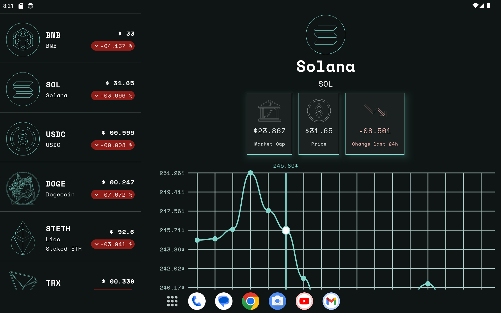

# CryptoTracker - Android Cryptocurrency Tracking App

  

A modern Android cryptocurrency tracking application that displays real-time price data and
historical trends for various cryptocurrencies.

## 🚀 Key Features

- **Real-time Cryptocurrency Data**: Fetches latest cryptocurrency prices and market information
- **Historical Price Charts**: Visualizes price trends over the last 5 days with interactive charts
- **Adaptive UI**: Responsive design that works seamlessly on both phones and tablets
- **Secure API Integration**: Implements proper API key handling through local.properties
- **Error Handling**: Comprehensive error handling with user-friendly Toast messages
- **Loading States**: Provides visual feedback during data fetching operations

## 📱 Screenshots

| | |
|---|---|
|  |  |



## 🛠️ Technologies & Architecture

### Tech Stack

- **Kotlin**: 100% Kotlin implementation
- **Jetpack Compose**: Modern UI toolkit for native Android interfaces
- **Ktor**: Asynchronous HTTP client for API communication
- **KOIN**: Lightweight dependency injection framework
- **Android Architecture Components**: ViewModel, StateFlow for reactive UI updates
- **Material 3 Adaptive**: Responsive layout components for different screen sizes

### Architecture

- **MVVM (Model-View-ViewModel)**: Clean separation of concerns and testable code
- **Single Source of Truth**: Data layer properly abstracted with domain models
- **Unidirectional Data Flow**: State hoisting pattern for predictable UI updates

## 🔐 Secure API Key Handling

This project implements a secure approach to handle API keys without exposing them in the
repository:

1. API keys are stored in `local.properties` which is automatically gitignored
2. The build system reads the API key from `local.properties` and injects it as a BuildConfig field
3. All API requests automatically include the authorization header using Ktor's `defaultRequest`
   feature

To set up your API key:

1. Add your API key to `local.properties`:
   ```properties
   API_KEY=your_actual_api_key_here
   ```

## 📱 UI Components

### Coin List Screen

- Displays all available cryptocurrencies with their symbols and names
- Shows current price in USD with proper formatting
- Visualizes 24-hour price change with color-coded indicators
- Implements lazy loading for efficient list rendering
- Responsive design with adaptive pane scaffold for different screen sizes

### Coin Detail Screen

- Detailed view of selected cryptocurrency
- Interactive chart showing price history over the last 5 days
- Responsive layout that adapts to different screen sizes
- Clean visual presentation with Material 3 components

## 🏗️ Project Structure

```
com.plcoding.cryptotracker
├── core
│   ├── data
│   │   └── networking
│   ├── domain
│   │   └── util
│   ├── navigation
│   └── presentation
│       └── util
├── crypto
│   ├── data
│   │   ├── mappers
│   │   └── networking
│   │       └── dto
│   ├── domain
│   └── presentation
│       ├── coin_detail
│       ├── coin_list
│       └── models
└── ui
    └── theme
```

## ⚙️ Dependencies

### Core Libraries

- `androidx.core:core-ktx` - Kotlin extensions for Android
- `androidx.lifecycle:lifecycle-runtime-ktx` - Lifecycle management
- `androidx.activity:activity-compose` - Compose integration with Activity

### Jetpack Compose

- `androidx.compose.bom` - Bill of materials for consistent versions
- `androidx.compose.ui:ui` - Core UI components
- `androidx.compose.material3:material3` - Material Design 3 components
- `androidx.compose.material3.adaptive:adaptive-navigation` - Adaptive layout components

### Networking

- `io.ktor:ktor-client-cio` - Ktor CIO engine
- `io.ktor:ktor-client-core` - Ktor core components
- `io.ktor:ktor-client-content-negotiation` - Content negotiation
- `io.ktor:ktor-client-logging` - Network logging
- `io.ktor:ktor-serialization-kotlinx-json` - JSON serialization

### Dependency Injection

- `io.insert-koin:koin-core` - KOIN core
- `io.insert-koin:koin-android` - KOIN Android integration
- `io.insert-koin:koin-androidx-compose` - KOIN Compose integration

## 📈 API Integration

This app integrates with the CoinCap API v3:

- `/assets` endpoint for listing cryptocurrencies
- `/assets/{id}/history` endpoint for historical price data
- Proper authorization header implementation with Bearer token

## 🎨 Design Principles

- **Material 3 Design**: Follows the latest Material Design guidelines
- **Responsive Layouts**: Adapts to different screen sizes (phones & tablets)
- **Dark Theme Support**: Automatically adapts to system theme preferences
- **Preview Annotations**: Uses Compose preview annotations for efficient UI testing

## 🧪 Testing Considerations

- **Unit Testing Ready**: MVVM architecture makes business logic easily testable
- **UI Testing Framework**: Compose testing libraries integrated for UI tests
- **Instrumentation Tests**: Espresso configured for Android UI testing

## 📦 Build Configuration

Both debug and release build types are properly configured with:

- BuildConfig fields for environment-specific values
- ProGuard rules for release optimization
- Proper versioning and signing configurations

---

## 🚀 Getting Started

1. Clone the repository
2. Add your CoinCap API key to `local.properties`:
   ```properties
   API_KEY=your_actual_api_key_here
   ```
3. Open the project in Android Studio
4. Build and run the application

## 📱 Screenshots

*Add screenshots of your app in action here to showcase the UI*

## 📄 License

This project is licensed under the MIT License - see the [LICENSE](LICENSE) file for details.

---

### 💼 Technical Skills Demonstrated

This project showcases my proficiency in:

- Modern Android development with Kotlin
- Jetpack Compose for declarative UI
- MVVM architecture pattern
- Dependency injection with KOIN
- Networking with Ktor
- Material Design 3 implementation
- Responsive UI design with adaptive components
- Secure handling of sensitive information (API keys)
- Error handling and state management
- Clean code architecture principles
